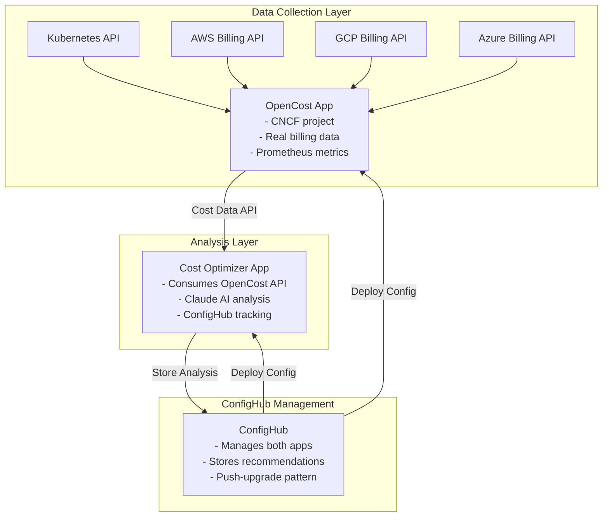

# OpenCost Integration with Cost Optimizer

## Executive Summary

Integrating OpenCost (CNCF Incubating project) with our Cost Optimizer creates a powerful combination: OpenCost provides accurate, real-time cost data from cloud providers, while our DevOps-as-Apps pattern adds persistent monitoring, AI analysis, and ConfigHub-driven deployment across environments.

## Why OpenCost + DevOps-as-Apps is Better

### OpenCost Alone (Traditional Deployment)
```yaml
# Traditional: One-off kubectl apply
kubectl apply -f opencost.yaml
# Result: Single instance, no environment management, no AI
```

### OpenCost as a DevOps App (Our Approach)
```yaml
# Our Pattern: ConfigHub-driven, multi-environment, AI-enhanced
bin/install-base      # OpenCost units in ConfigHub
bin/install-envs      # Dev → Staging → Prod hierarchy
bin/apply-all dev     # Deploy with full tracking
# Result: Persistent app, Claude AI analysis, environment promotion
```

## Architecture: Two Persistent Apps Working Together



## ConfigHub Value Add

### 1. Managing OpenCost Across Environments
```bash
# OpenCost configuration as ConfigHub units
{prefix}-opencost-base/
├── opencost-deployment.yaml      # OpenCost app deployment
├── opencost-config.yaml          # Cloud provider configs
├── opencost-prometheus.yaml      # Metrics export config
└── opencost-ui.yaml              # Web UI configuration

# Environment-specific configs
{prefix}-opencost-dev/
├── opencost-config.yaml          # Dev AWS account
{prefix}-opencost-staging/
├── opencost-config.yaml          # Staging AWS account
{prefix}-opencost-prod/
├── opencost-config.yaml          # Prod AWS account (with discounts)
```

### 2. Cost Data Pipeline
```go
// Our cost-optimizer consumes OpenCost's accurate data
func (c *CostOptimizer) gatherCostData() (*CostAnalysis, error) {
    // 1. Query OpenCost API for real cost data
    opencostData, err := c.queryOpenCostAPI("/allocation/compute")

    // 2. Store raw data in ConfigHub for audit trail
    c.app.Cub.CreateUnit(Unit{
        Name: fmt.Sprintf("cost-data-%s", time.Now()),
        Data: opencostData,
        Labels: map[string]string{
            "source": "opencost",
            "provider": opencostData.Provider,
            "total-cost": fmt.Sprintf("%.2f", opencostData.TotalCost),
        },
    })

    // 3. Send to Claude for intelligent analysis
    recommendations := c.app.Claude.AnalyzeJSON(
        "Analyze this OpenCost data for optimization opportunities",
        opencostData,
    )

    // 4. Store recommendations in ConfigHub Sets
    if recommendations.Savings > 100 {
        c.app.Cub.AddToSet("critical-costs", recommendations)
    }

    return analysis, nil
}
```

### 3. Global-App Pattern Implementation

#### OpenCost Deployment Pattern
```bash
#!/bin/bash
# bin/install-opencost-base

# Generate unique prefix (canonical pattern)
prefix=$(cub space new-prefix)
project="${prefix}-opencost"

# Create ConfigHub structure for OpenCost
cub space create $project --label app=opencost
cub space create $project-base --label base=true
cub space create $project-filters --label type=filters

# Create OpenCost units from configs
cub unit create opencost-deployment confighub/opencost/deployment.yaml \
  --space $project-base \
  --label tier=infrastructure

cub unit create opencost-config confighub/opencost/config.yaml \
  --space $project-base \
  --label tier=infrastructure

# Create filter for OpenCost components
cub filter create opencost-components Unit \
  --where-field "Labels.app='opencost'" \
  --space $project-filters

echo "OpenCost base setup complete!"
```

#### Environment-Specific Cloud Configs
```bash
#!/bin/bash
# bin/configure-opencost-environments

project=$(cat .cub-project)

# Dev environment - uses on-demand pricing
cub unit update opencost-config --space $project-dev --patch \
  '{"spec": {"cloudProvider": "aws", "region": "us-east-1", "pricing": "on-demand"}}'

# Staging - includes reserved instances
cub unit update opencost-config --space $project-staging --patch \
  '{"spec": {"cloudProvider": "aws", "region": "us-east-1", "pricing": "reserved"}}'

# Production - negotiated enterprise discounts
cub unit update opencost-config --space $project-prod --patch \
  '{"spec": {"cloudProvider": "aws", "region": "us-east-1", "pricing": "enterprise", "discount": 0.25}}'
```

## Implementation Plan

### Phase 1: Deploy OpenCost as DevOps App
```go
// opencost-app/main.go
type OpenCostApp struct {
    app *sdk.DevOpsApp
}

func main() {
    // OpenCost runs as persistent DevOps app
    app, _ := sdk.NewDevOpsApp(sdk.DevOpsAppConfig{
        Name:        "opencost",
        Version:     "1.110.0",
        Description: "CNCF cost monitoring with ConfigHub management",
    })

    // Use informers to watch for cost changes
    app.RunWithInformers(func() error {
        // OpenCost core logic
        collectCloudCosts()
        exportPrometheusMetrics()
        return nil
    })
}
```

### Phase 2: Enhance Cost Optimizer
```go
// cost-optimizer/main.go
func (c *CostOptimizer) analyzeWithOpenCost() {
    // Query OpenCost instead of calculating estimates
    costs, _ := c.queryOpenCost("/api/v1/allocation/compute")

    // Claude analyzes real costs, not estimates
    analysis, _ := c.app.Claude.Analyze(costs)

    // Store in ConfigHub with OpenCost data
    c.app.Cub.CreateUnit(Unit{
        Name: "cost-analysis-" + time.Now(),
        Data: map[string]interface{}{
            "opencost_data": costs,
            "claude_analysis": analysis,
            "source": "opencost-1.110.0",
        },
    })
}
```

### Phase 3: ConfigHub Sets for Cost Governance
```bash
# Group high-cost resources identified by OpenCost
cub set create gpu-workloads --space $project \
  --label cost-category=gpu

cub set create data-intensive --space $project \
  --label cost-category=storage

# Apply optimizations to entire Sets
cub bulk patch --set gpu-workloads \
  --patch '{"spec": {"nodeSelector": {"instance-type": "spot"}}}'
```

## Advantages Over Traditional OpenCost Deployment

| Aspect | Traditional OpenCost | OpenCost as DevOps App |
|--------|---------------------|------------------------|
| **Deployment** | kubectl apply | ConfigHub units with full versioning |
| **Multi-Environment** | Manual per cluster | Push-upgrade pattern |
| **Cost Analysis** | View in UI | Claude AI recommendations |
| **Configuration** | Edit YAML files | ConfigHub direct editing |
| **Drift Detection** | None | Our drift-detector monitors OpenCost |
| **Rollback** | kubectl delete/apply | ConfigHub instant rollback |
| **Audit Trail** | Prometheus metrics only | Full ConfigHub history |

## OpenCost Plugin Architecture Integration

### Create Custom ConfigHub Plugin for OpenCost
```go
// opencost-confighub-plugin/main.go
type ConfigHubCostPlugin struct {
    cub *sdk.ConfigHubClient
}

func (p *ConfigHubCostPlugin) GetCustomCosts() ([]CustomCost, error) {
    // Export ConfigHub platform costs to OpenCost
    units, _ := p.cub.ListUnits()

    costs := []CustomCost{}
    for _, unit := range units {
        costs = append(costs, CustomCost{
            Resource: unit.Name,
            Cost: calculateConfigHubCost(unit),
            Labels: unit.Labels,
        })
    }

    return costs
}
```

## Carbon Emissions Tracking
```yaml
# OpenCost now tracks carbon emissions
# We store this in ConfigHub for compliance
carbon-emissions/
├── daily-reports/
│   └── 2024-01-15.yaml    # Carbon data from OpenCost
├── optimization-targets/
│   └── high-carbon-set     # Set of high-emission workloads
└── compliance-audit/
    └── carbon-reduction    # Track reduction over time
```

## Why This Architecture Wins

### 1. **Best of Both Worlds**
- OpenCost: Accurate cost data from cloud providers
- Our Pattern: Persistent apps, AI analysis, ConfigHub management

### 2. **Event-Driven Cost Optimization**
```go
// OpenCost detects cost spike → Triggers our optimizer → Claude analyzes → Auto-applies fix
informer.AddEventHandler(cache.ResourceEventHandlerFuncs{
    AddFunc: func(obj interface{}) {
        if cost := opencost.GetCost(obj); cost > threshold {
            recommendation := claude.Analyze(cost)
            cub.ApplyOptimization(recommendation)
        }
    },
})
```

### 3. **Multi-Cloud with ConfigHub Sets**
```bash
# OpenCost tracks AWS, GCP, Azure costs
# ConfigHub Sets group resources by cloud provider
cub set create aws-resources --filter "Labels.cloud='aws'"
cub set create gcp-resources --filter "Labels.cloud='gcp'"
cub set create azure-resources --filter "Labels.cloud='azure'"

# Apply cloud-specific optimizations
cub bulk patch --set aws-resources --patch '{"spec": {"instance-type": "t3.medium"}}'
```

## Next Steps

1. **Fork OpenCost** and add ConfigHub client to store cost data as units
2. **Enhance SDK** to include OpenCost client alongside Claude and ConfigHub
3. **Update Cost Optimizer** to consume OpenCost API instead of estimates
4. **Create Dashboard** that combines OpenCost metrics with Claude recommendations
5. **Build Plugins** for OpenCost to track ConfigHub platform costs

## Conclusion

OpenCost + DevOps-as-Apps pattern creates a superior cost management solution:
- **Accurate Data**: Real costs from OpenCost, not estimates
- **Intelligent Analysis**: Claude AI on top of OpenCost data
- **Environment Management**: ConfigHub manages OpenCost across dev/staging/prod
- **Event-Driven**: Informers react to cost changes in real-time
- **Audit Trail**: Every cost analysis and optimization tracked in ConfigHub

This is how modern cost optimization should work - persistent apps, not scripts or workflows!