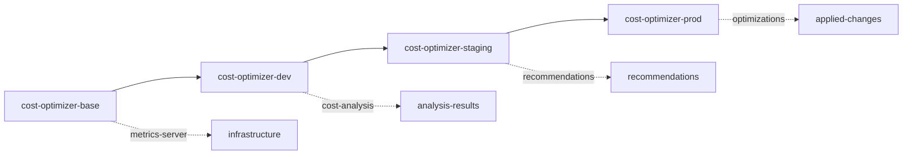

# Cost Optimizer

AI-powered Kubernetes cost optimization that leverages ConfigHub's unique capabilities for continuous, multi-environment cost management.

## 🆕 OpenCost Integration

The cost optimizer now integrates with [OpenCost](https://www.opencost.io/) (CNCF Incubating project) for real-time, accurate cloud cost data instead of estimates.

### Quick Setup

```bash
# 1. Configure OpenCost integration (creates ConfigHub unit)
./bin/configure-opencost true   # Enable OpenCost
# or
./bin/configure-opencost false  # Disable OpenCost

# 2. Install OpenCost (if not already deployed)
./bin/install-opencost-base     # Create ConfigHub units
./bin/install-opencost-envs     # Set up environments
./bin/apply-opencost dev        # Deploy to Kubernetes

# 3. Run cost optimizer - it will auto-detect OpenCost
ENABLE_OPENCOST=true ./cost-optimizer  # Force enable
ENABLE_OPENCOST=false ./cost-optimizer # Force disable
./cost-optimizer                       # Auto-detect from ConfigHub
```

### How OpenCost Integration Works

1. **ConfigHub Configuration**: The `configure-opencost` script creates an `opencost-config` unit in your ConfigHub space
2. **Auto-Detection**: Cost optimizer checks ConfigHub for the config unit on startup
3. **Fallback**: If OpenCost is unavailable, it falls back to AWS pricing estimates
4. **Environment Variables**:
   - `ENABLE_OPENCOST=false` to disable (default: enabled)
   - `OPENCOST_URL=http://...` to override endpoint

### OpenCost Deployment Pattern

OpenCost follows the same DevOps-as-Apps pattern:
- Deployed via ConfigHub units (not kubectl)
- Environment hierarchy: base → dev → staging → prod
- Push-upgrade for promotion
- Persistent monitoring app, not ephemeral workflow

## Why ConfigHub Makes This Better Than DIY or Agentic DevOps Workflow Tools

### vs DIY Cost Scripts
- **Persistent State**: ConfigHub tracks all cost analyses in versioned units (not lost in logs)
- **Multi-Environment**: Push cost optimizations from dev → staging → prod atomically
- **Audit Trail**: Every recommendation and application is tracked with who/what/when
- **Rollback**: Instant rollback of any optimization that causes issues

### vs Agentic DevOps Tools
- **Continuous Monitoring**: Runs 24/7 with informers (not just when triggered)
- **Stateful Analysis**: Builds cost trends over time in ConfigHub Sets
- **Bulk Operations**: Apply optimizations across ALL environments with one command
- **AI Memory**: Claude recommendations stored and tracked across runs

## Scenario

The Cost Optimizer continuously monitors your Kubernetes clusters across multiple environments, using Claude AI to generate intelligent cost-saving recommendations that are tracked, versioned, and promotable through ConfigHub.

### ConfigHub Layout

The optimizer uses ConfigHub's space hierarchy to manage cost analysis across environments:



### Unit Organization

```
{prefix}-cost-optimizer/
├── Units (Configurations)
│   ├── cost-optimizer-deployment     # App deployment config
│   ├── cost-optimizer-service        # Service endpoints
│   ├── cost-optimizer-rbac          # Permissions
│   └── metrics-server               # Required infrastructure
│
├── Sets (Grouped Analysis)
│   ├── critical-costs               # High-priority items >$50/month
│   ├── cost-recommendations        # All AI recommendations
│   └── applied-optimizations       # Implemented changes
│
└── Filters (Smart Queries)
    ├── high-cost                   # Resources >$100/month
    ├── low-utilization             # <50% CPU/memory usage
    └── auto-applicable             # Low-risk optimizations
```

## Setup

### Configure ConfigHub Structure

First, set up the ConfigHub spaces and base units:

```bash
bin/install-base
```

This creates:
- Unique project prefix (e.g., `fluffy-kitten`)
- Base space with optimizer configurations
- Filters for cost analysis queries
- Sets for grouping recommendations

Next, set up the environment hierarchy:

```bash
bin/install-envs
```

This establishes dev → staging → prod promotion paths with proper upstream relationships.

### View ConfigHub Structure

Check what's been created:

```bash
cub unit tree --node=space --filter $(cat .cub-project)/cost --space '*'
```

Output:
```
NODE                                UNIT                    STATUS    UPGRADE-NEEDED    UNAPPLIED-CHANGES
└── fluffy-kitten-base             cost-optimizer-deployment NoLive
    ├── fluffy-kitten-dev          cost-optimizer-deployment NoLive    No               Yes
    ├── fluffy-kitten-staging      cost-optimizer-deployment NoLive    No               No
    └── fluffy-kitten-prod         cost-optimizer-deployment NoLive    No               No
└── fluffy-kitten-base             cost-optimizer-service   NoLive
    ├── fluffy-kitten-dev          cost-optimizer-service   NoLive    No               Yes
    ├── fluffy-kitten-staging      cost-optimizer-service   NoLive    No               No
    └── fluffy-kitten-prod         cost-optimizer-service   NoLive    No               No
└── fluffy-kitten-base             metrics-server           NoLive
    ├── fluffy-kitten-dev          metrics-server           Applied   No               No
    ├── fluffy-kitten-staging      metrics-server           NoLive    No               No
    └── fluffy-kitten-prod         metrics-server           NoLive    No               No
```

### Deploy to Kubernetes

Deploy to dev environment:

```bash
bin/apply-all dev
```

This uses ConfigHub's atomic apply to deploy all units together.

## Key ConfigHub Features in Action

### 1. Cost Analysis Storage (Units for Configuration)

Cost optimizer configurations are stored as ConfigHub units:

```bash
# View optimizer units
cub unit list --space fluffy-kitten-base

# Output shows your configuration units:
# - cost-optimizer-deployment
# - cost-optimizer-service
# - cost-optimizer-rbac
# - metrics-server
```

### 2. Recommendation Tracking (Sets for Grouping)

Organize units into Sets for bulk operations:

```bash
# Create a set for critical services
cub set create critical-costs --space fluffy-kitten-base \
  --label priority=high

# Note: Sets in ConfigHub are managed through unit creation with SetIDs
# Units are added to sets when created or updated

# View set
cub set get critical-costs --space fluffy-kitten-base
```

### 3. Bulk Operations (Filters + BulkPatch)

Apply changes across multiple units:

```bash
# Create filter for units to optimize
cub filter create cost-units Unit \
  --where-field "Space.Labels.project = 'fluffy-kitten'" \
  --space fluffy-kitten-filters

# Apply patches to matching units using filter
# Note: bulk patch requires a filter to be created first
cub filter create optimizer-units Unit \
  --where-field "Labels.app = 'cost-optimizer'" \
  --space fluffy-kitten-filters

# Then use bulk operations with the filter
cub unit update cost-optimizer-deployment \
  --space fluffy-kitten-dev \
  --patch '{"spec": {"replicas": 2}}'
```

### 4. Promotion Path (Push-Upgrade Pattern)

Test optimizations in dev, then promote:

```bash
# Test in dev
bin/apply-all dev
# Monitor for 24 hours...

# Promote to staging using push-upgrade
bin/promote dev staging
bin/apply-all staging
# Monitor for 3 days...

# Continue promotion chain
bin/promote staging prod
bin/apply-all prod
```

### 5. Version Management

Manage cost-optimizer versions across environments:

```bash
# Set specific version in dev
bin/set-version 1.0.0 dev

# Set version in staging
bin/set-version 1.0.1 staging

# View current version
cub unit get cost-optimizer-deployment --space fluffy-kitten-dev \
  --format json | jq '.spec.template.spec.containers[0].image'
```

### 6. Rollback Capability

Leverage ConfigHub's revision history for safe rollbacks:

```bash
# Rollback to previous version
bin/rollback dev

# Rollback staging to 2 versions ago
bin/rollback staging -2

# Rollback prod to specific revision
bin/rollback prod 5

# View revision history
cub revision list cost-optimizer-deployment --space fluffy-kitten-dev
```

### 7. Configuration Management

If an optimization causes issues, update the unit:

```bash
# Update unit to previous configuration
cub unit update cost-optimizer-deployment \
  --space fluffy-kitten-prod \
  --data @previous-config.yaml

# View unit configuration
cub unit get cost-optimizer-deployment \
  --space fluffy-kitten-prod --format json
```

## Real-World Cost Optimization Flow

### 1. Continuous Analysis
The optimizer runs 24/7, analyzing costs every 15 minutes:

```go
// Uses Kubernetes informers for real-time metrics
app.RunWithInformers(func() error {
    analysis := AnalyzeCosts()
    recommendations := claude.GenerateRecommendations(analysis)

    // Apply recommended configurations via ConfigHub
    if recommendations.ShouldOptimize {
        // Update deployment configuration in ConfigHub
        cub.UpdateUnit(spaceID, unitID,
            updatedConfig)
    }

    return nil
})
```

### 2. AI Recommendation Generation
Claude analyzes patterns and suggests optimizations that are applied via ConfigHub:

```json
{
  "recommendation": {
    "resource": "deployment/backend-api",
    "type": "rightsize",
    "current": {"cpu": "500m", "memory": "512Mi", "replicas": 5},
    "suggested": {"cpu": "200m", "memory": "256Mi", "replicas": 3},
    "monthly_savings": 73.65,
    "risk": "low",
    "action": "Update ConfigHub unit with new resource limits"
  }
}
```

### 3. Automated Application
Low-risk optimizations can be auto-applied:

```bash
# The optimizer automatically:
1. Updates configuration units in ConfigHub
2. Groups related units using Sets
3. Applies changes if AUTO_APPLY_OPTIMIZATIONS=true
4. Uses ConfigHub revision history for tracking
```

## Dashboard & Monitoring

### Web Dashboard (Port 8081)
- Real-time cost visualization
- AI recommendations with one-click apply
- ConfigHub unit browser
- Claude session history viewer

### Sample Dashboard View
```
┌─────────────────────────────────────────────────────────┐
│ Total Monthly Cost: $1,245.67                          │
│ Potential Savings:  $287.45 (23.1%)                    │
│                                                         │
│ Top Recommendations:                                   │
│ • backend-api:     ↓ 3 replicas    Save $73.65/mo    │
│ • redis-cache:     ↓ instance size  Save $62.10/mo    │
│ • frontend-web:    ↓ CPU/memory     Save $45.23/mo    │
│                                                         │
│ ConfigHub Status:                                      │
│ • Space: fluffy-kitten-dev                            │
│ • Pending Changes: 3                                   │
│ • [Apply All] [Review] [Rollback]                     │
└─────────────────────────────────────────────────────────┘
```

## Advanced ConfigHub Features

### Apply Gates (Future Feature)

ConfigHub will support gates for controlled promotion:

```bash
# Set up production gate (when available)
cub space set-gate fluffy-kitten-prod \
  --require-approval true \
  --approvers "platform-team"

# Check gate status
cub gate status --space fluffy-kitten-prod

# Approve promotion
cub gate approve --space fluffy-kitten-prod \
  --comment "Tested in staging for 3 days"
```

### Version Tracking

Track all versions across environments:

```bash
# View version across all environments
for env in dev staging prod; do
  echo "$env: $(cub unit get cost-optimizer-deployment \
    --space fluffy-kitten-$env --format json | \
    jq -r '.spec.template.spec.containers[0].image')"
done
```

## ConfigHub Advantages Summary

| Feature | DIY Script | Agentic Workflow | ConfigHub + Cost Optimizer |
|---------|------------|----------------|---------------------------|
| **Execution Model** | Cron job | Triggered workflow | Continuous with informers |
| **State Management** | Log files | Stateless | Versioned units in ConfigHub |
| **Multi-Environment** | Manual copy | Re-run workflow | Push-upgrade propagation |
| **Bulk Operations** | Loop & apply | Multiple triggers | Single filter + bulk-patch |
| **Rollback** | Git revert | Re-run old version | Revision history rollback |
| **Audit Trail** | Logs | Workflow history | Full unit versioning |
| **AI Integration** | API calls | In workflow | AI-driven config updates |
| **Cost Tracking** | Spreadsheet | External tool | Sets for grouping configs |
| **Version Management** | Manual tags | CI/CD pipeline | `cub run set-image-reference` |
| **Apply Gates** | Manual approval | Pipeline gates | ConfigHub gates (future) |

## Quick Start

```bash
# 1. Setup ConfigHub
export CUB_TOKEN="your-token"
bin/install-base
bin/install-envs

# 2. Deploy metrics-server
bin/deploy-metrics-server

# 3. Run optimizer
export CLAUDE_API_KEY="your-key"
./cost-optimizer

# 4. View dashboard
open http://localhost:8081

# 5. Check recommendations
cub set get critical-costs --space $(cat .cub-project)-base
```

## Integration with CI/CD

```yaml
# GitHub Actions example
- name: Analyze Costs
  run: |
    ./cost-optimizer --mode=analyze

- name: Review Critical Sets
  run: |
    cub set get critical-costs --space ${{ env.PROJECT }}-dev

- name: Apply Optimizations
  if: github.ref == 'refs/heads/main'
  run: |
    cub unit apply cost-optimizer-deployment --space ${{ env.PROJECT }}-dev
```

---

**Built with ConfigHub** • **Powered by Claude AI** • **Better than DIY or Agentic DevOps Tools**