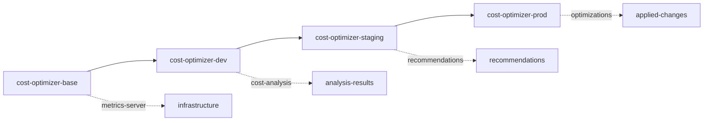

# Cost Optimizer

AI-powered Kubernetes cost optimization that leverages ConfigHub's unique capabilities for continuous, multi-environment cost management.

## Why ConfigHub Makes This Better Than DIY or Cased

### vs DIY Cost Scripts
- **Persistent State**: ConfigHub tracks all cost analyses in versioned units (not lost in logs)
- **Multi-Environment**: Push cost optimizations from dev → staging → prod atomically
- **Audit Trail**: Every recommendation and application is tracked with who/what/when
- **Rollback**: Instant rollback of any optimization that causes issues

### vs Cased Workflows
- **Continuous Monitoring**: Runs 24/7 with informers (not just when triggered)
- **Stateful Analysis**: Builds cost trends over time in ConfigHub Sets
- **Bulk Operations**: Apply optimizations across ALL environments with one command
- **AI Memory**: Claude recommendations stored and tracked across runs

## Scenario

The Cost Optimizer continuously monitors your Kubernetes clusters across multiple environments, using Claude AI to generate intelligent cost-saving recommendations that are tracked, versioned, and promotable through ConfigHub.

### ConfigHub Layout

The optimizer uses ConfigHub's space hierarchy to manage cost analysis across environments:



### Unit Organization

```
{prefix}-cost-optimizer/
├── Units (Configurations)
│   ├── cost-optimizer-deployment     # App deployment config
│   ├── cost-optimizer-service        # Service endpoints
│   ├── cost-optimizer-rbac          # Permissions
│   └── metrics-server               # Required infrastructure
│
├── Sets (Grouped Analysis)
│   ├── critical-costs               # High-priority items >$50/month
│   ├── cost-recommendations        # All AI recommendations
│   └── applied-optimizations       # Implemented changes
│
└── Filters (Smart Queries)
    ├── high-cost                   # Resources >$100/month
    ├── low-utilization             # <50% CPU/memory usage
    └── auto-applicable             # Low-risk optimizations
```

## Setup

### Configure ConfigHub Structure

First, set up the ConfigHub spaces and base units:

```bash
bin/install-base
```

This creates:
- Unique project prefix (e.g., `fluffy-kitten`)
- Base space with optimizer configurations
- Filters for cost analysis queries
- Sets for grouping recommendations

Next, set up the environment hierarchy:

```bash
bin/install-envs
```

This establishes dev → staging → prod promotion paths with proper upstream relationships.

### View ConfigHub Structure

Check what's been created:

```bash
cub unit tree --node=space --filter $(cat .cub-project)/cost --space '*'
```

Output:
```
NODE                                UNIT                    STATUS    UPGRADE-NEEDED    UNAPPLIED-CHANGES
└── fluffy-kitten-base             cost-optimizer-deployment NoLive
    ├── fluffy-kitten-dev          cost-optimizer-deployment NoLive    No               Yes
    ├── fluffy-kitten-staging      cost-optimizer-deployment NoLive    No               No
    └── fluffy-kitten-prod         cost-optimizer-deployment NoLive    No               No
└── fluffy-kitten-base             cost-optimizer-service   NoLive
    ├── fluffy-kitten-dev          cost-optimizer-service   NoLive    No               Yes
    ├── fluffy-kitten-staging      cost-optimizer-service   NoLive    No               No
    └── fluffy-kitten-prod         cost-optimizer-service   NoLive    No               No
└── fluffy-kitten-base             metrics-server           NoLive
    ├── fluffy-kitten-dev          metrics-server           Applied   No               No
    ├── fluffy-kitten-staging      metrics-server           NoLive    No               No
    └── fluffy-kitten-prod         metrics-server           NoLive    No               No
```

### Deploy to Kubernetes

Deploy to dev environment:

```bash
bin/apply-all dev
```

This uses ConfigHub's atomic apply to deploy all units together.

## Key ConfigHub Features in Action

### 1. Cost Analysis Storage (Units as Database)

Every cost analysis is stored as a ConfigHub unit, creating a queryable history:

```bash
# View all cost analyses
cub unit list --space fluffy-kitten-analysis --label type=cost-analysis

ID                                    NAME                 CREATED              MONTHLY-COST
8f3a2b1c-4d5e-6f7a-8b9c-0d1e2f3a4b5c  analysis-2024-01-15  2024-01-15T10:30:00  $1,245.67
7e2a1b0c-3d4e-5f6a-7b8c-9d0e1f2a3b4c  analysis-2024-01-14  2024-01-14T10:30:00  $1,312.45
6d1a0b9c-2d3e-4f5a-6b7c-8d9e0f1a2b3c  analysis-2024-01-13  2024-01-13T10:30:00  $1,298.23
```

### 2. Recommendation Tracking (Sets for Grouping)

Critical recommendations are automatically added to Sets:

```bash
# View critical cost-saving opportunities
cub set get critical-costs --space fluffy-kitten-base

MEMBERS (4 units with potential savings >$50/month):
- backend-api:       Reduce from 5 to 2 replicas     ($73.65/month saving)
- frontend-web:      Rightsize CPU/memory limits      ($45.23/month saving)
- redis-cache:       Switch to smaller instance       ($62.10/month saving)
- postgres-primary:  Enable auto-scaling              ($51.45/month saving)

Total Potential Savings: $232.43/month
```

### 3. Bulk Optimization (Filters + BulkPatch)

Apply AI recommendations across ALL environments:

```bash
# Create filter for auto-applicable optimizations
cub filter create auto-apply Unit \
  --where-field "Labels.risk='low' AND Labels.savings > 20"

# Apply to all matching resources
cub unit bulk-patch --filter fluffy-kitten/auto-apply \
  --patch '{"spec": {"replicas": 2}}'

Applied to 12 units across dev, staging, prod
Estimated monthly savings: $287.45
```

### 4. Promotion Path (Push-Upgrade Pattern)

Test optimizations in dev, then promote:

```bash
# Test in dev
bin/apply-all dev
# Monitor for 24 hours...

# Promote to staging
cub unit update --patch --upgrade --space fluffy-kitten-staging
bin/apply-all staging
# Monitor for 3 days...

# Promote to prod with confidence
cub unit update --patch --upgrade --space fluffy-kitten-prod
bin/apply-all prod
```

### 5. Instant Rollback

If an optimization causes issues:

```bash
# Revert to previous version
cub unit rollback cost-optimizer-deployment --space fluffy-kitten-prod

# Or revert entire Set
cub set rollback critical-costs --space fluffy-kitten-prod
```

## Real-World Cost Optimization Flow

### 1. Continuous Analysis
The optimizer runs 24/7, analyzing costs every 15 minutes:

```go
// Uses Kubernetes informers for real-time metrics
app.RunWithInformers(func() error {
    analysis := AnalyzeCosts()
    recommendations := claude.GenerateRecommendations(analysis)

    // Store in ConfigHub for tracking
    sdk.CreateUnit(Unit{
        Name: fmt.Sprintf("analysis-%s", time.Now()),
        Data: analysis,
        Labels: map[string]string{
            "total-cost": fmt.Sprintf("%.2f", analysis.TotalCost),
            "savings": fmt.Sprintf("%.2f", analysis.PotentialSavings),
        },
    })

    return nil
})
```

### 2. AI Recommendation Generation
Claude analyzes patterns and suggests optimizations:

```json
{
  "recommendation": {
    "resource": "deployment/backend-api",
    "type": "rightsize",
    "current": {"cpu": "500m", "memory": "512Mi", "replicas": 5},
    "suggested": {"cpu": "200m", "memory": "256Mi", "replicas": 3},
    "monthly_savings": 73.65,
    "risk": "low",
    "confighub_action": "Update deployment unit with new limits"
  }
}
```

### 3. Automated Application
Low-risk optimizations can be auto-applied:

```bash
# The optimizer automatically:
1. Creates optimization unit in ConfigHub
2. Adds to appropriate Set (critical-costs)
3. Applies if AUTO_APPLY_OPTIMIZATIONS=true
4. Tracks results for analysis
```

## Dashboard & Monitoring

### Web Dashboard (Port 8081)
- Real-time cost visualization
- AI recommendations with one-click apply
- ConfigHub unit browser
- Claude session history viewer

### Sample Dashboard View
```
┌─────────────────────────────────────────────────────────┐
│ Total Monthly Cost: $1,245.67                          │
│ Potential Savings:  $287.45 (23.1%)                    │
│                                                         │
│ Top Recommendations:                                   │
│ • backend-api:     ↓ 3 replicas    Save $73.65/mo    │
│ • redis-cache:     ↓ instance size  Save $62.10/mo    │
│ • frontend-web:    ↓ CPU/memory     Save $45.23/mo    │
│                                                         │
│ ConfigHub Status:                                      │
│ • Space: fluffy-kitten-dev                            │
│ • Pending Changes: 3                                   │
│ • [Apply All] [Review] [Rollback]                     │
└─────────────────────────────────────────────────────────┘
```

## ConfigHub Advantages Summary

| Feature | DIY Script | Cased Workflow | ConfigHub + Cost Optimizer |
|---------|------------|----------------|---------------------------|
| **Execution Model** | Cron job | Triggered workflow | Continuous with informers |
| **State Management** | Log files | Stateless | Versioned units in ConfigHub |
| **Multi-Environment** | Manual copy | Re-run workflow | Push-upgrade propagation |
| **Bulk Operations** | Loop & apply | Multiple triggers | Single filter + bulk-patch |
| **Rollback** | Git revert | Re-run old version | Instant ConfigHub rollback |
| **Audit Trail** | Logs | Workflow history | Full unit versioning |
| **AI Integration** | API calls | In workflow | Stored recommendations |
| **Cost Tracking** | Spreadsheet | External tool | Built-in Sets and queries |

## Quick Start

```bash
# 1. Setup ConfigHub
export CUB_TOKEN="your-token"
bin/install-base
bin/install-envs

# 2. Deploy metrics-server
bin/deploy-metrics-server

# 3. Run optimizer
export CLAUDE_API_KEY="your-key"
./cost-optimizer

# 4. View dashboard
open http://localhost:8081

# 5. Check recommendations
cub set get critical-costs --space $(cat .cub-project)-base
```

## Integration with CI/CD

```yaml
# GitHub Actions example
- name: Analyze Costs
  run: |
    ./cost-optimizer --mode=analyze

- name: Review Critical Costs
  run: |
    cub set get critical-costs --space ${{ env.PROJECT }}-dev

- name: Auto-Apply Low Risk
  if: github.ref == 'refs/heads/main'
  run: |
    cub unit bulk-patch --filter auto-apply --upgrade
```

---

**Built with ConfigHub** • **Powered by Claude AI** • **Better than DIY or Cased**