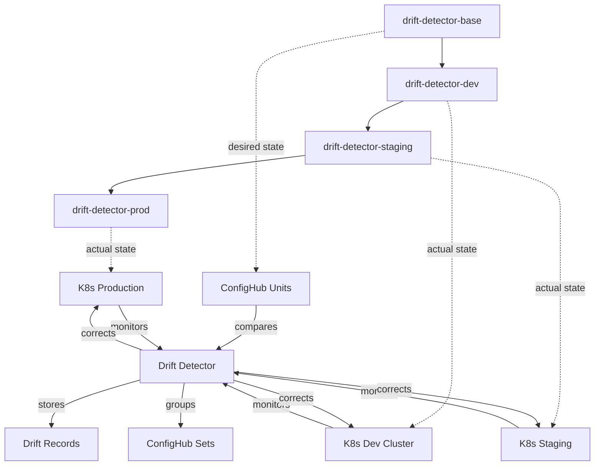

# Drift Detector

Event-driven Kubernetes configuration drift detection that leverages ConfigHub's unique capabilities for continuous compliance across multi-environment deployments.

## Why ConfigHub Makes This Better Than DIY or Cased

### vs DIY Drift Scripts
- **Persistent Drift History**: Every drift is stored as a ConfigHub unit (not lost in logs)
- **Multi-Environment Tracking**: See drift patterns across dev → staging → prod
- **Auto-Remediation**: Apply corrections atomically with ConfigHub rollback
- **Compliance Audit**: Complete who/what/when/why trail for every change

### vs Cased Workflows
- **Event-Driven**: Uses Kubernetes informers (instant detection vs polling)
- **Stateful Tracking**: Builds drift patterns over time in ConfigHub Sets
- **Bulk Correction**: Fix drift across ALL environments with one filter
- **Self-Healing**: Automatic correction with ConfigHub as source of truth

## Scenario

The Drift Detector continuously monitors your Kubernetes clusters, comparing live state against ConfigHub units (your source of truth). When drift is detected, it can auto-correct, alert, or track for later remediation - all while maintaining a complete audit trail.

### ConfigHub Layout

The detector uses ConfigHub's space hierarchy to track drift across environments:



### Unit Organization

```
{prefix}-drift-detector/
├── Units (Configurations)
│   ├── drift-detector-deployment    # App deployment config
│   ├── drift-detector-service       # Service endpoints
│   ├── drift-detector-rbac         # Permissions
│   └── namespace                   # Infrastructure setup
│
├── Sets (Grouped Drifts)
│   ├── critical-drifts             # Security/compliance issues
│   ├── resource-drifts             # CPU/memory changes
│   ├── replica-drifts              # Scaling deviations
│   └── corrected-drifts            # Successfully fixed items
│
└── Filters (Smart Queries)
    ├── security-drift              # RBAC and secret changes
    ├── production-drift            # Prod-only deviations
    ├── auto-correctable           # Safe to auto-fix
    └── manual-review              # Requires human approval
```

## Setup

### Configure ConfigHub Structure

First, set up the ConfigHub spaces and base units:

```bash
# Install base configurations in ConfigHub
bin/install-base

# Set up environment hierarchy (dev → staging → prod)
bin/install-envs

# View the created structure
cub unit tree --node=space --filter drift-detector --space '*'
```

### Step 2: Deploy to Kubernetes via ConfigHub

```bash
# Create secrets first
kubectl create secret generic drift-detector-secrets \
  --from-literal=cub-token=$CUB_TOKEN \
  --from-literal=claude-api-key=$CLAUDE_API_KEY \
  -n devops-apps

# Apply all units to dev environment
bin/apply-all dev

# Or apply to specific environment
bin/apply-all staging
bin/apply-all prod
```

### Step 3: Promote Through Environments

```bash
# After testing in dev, promote to staging
bin/promote dev staging

# After validation in staging, promote to prod
bin/promote staging prod
```

## Running Locally (Development)

```bash
# Set environment variables
export KUBECONFIG=/path/to/kubeconfig
export CUB_TOKEN=your-confighub-token
export CLAUDE_API_KEY=your-claude-key  # Optional

# Build and run
go build
./drift-detector
```

## ConfigHub Structure

The drift-detector follows the global-app pattern with this hierarchy:

```
drift-detector (main space)
├── drift-detector-filters (filters for targeting)
├── drift-detector-base (base configurations)
│   ├── namespace.yaml
│   ├── drift-detector-rbac.yaml
│   ├── drift-detector-deployment.yaml
│   └── drift-detector-service.yaml
├── drift-detector-dev (cloned from base)
├── drift-detector-staging (cloned from dev)
└── drift-detector-prod (cloned from staging)
```

Each environment inherits from its upstream:
- **base** → dev → staging → prod
- Changes flow through push-upgrade pattern
- Each environment can have local customizations

## Configuration

| Environment Variable | Description | Default |
|---------------------|-------------|---------|
| `NAMESPACE` | Kubernetes namespace to monitor | `qa` |
| `CUB_SPACE` | ConfigHub space to use as desired state | `acorn-bear-qa` |
| `CUB_API_URL` | ConfigHub API endpoint | `https://hub.confighub.com/api/v1` |
| `CUB_TOKEN` | ConfigHub API token | Required |
| `CLAUDE_API_KEY` | Claude API key for AI analysis | Optional |
| `AUTO_FIX` | Create fixes automatically | `false` |

## Viewing Drift Detection

### 🔍 Monitoring Dashboard

The drift detector includes a real-time monitoring dashboard:

```bash
# Open the dashboard and ConfigHub
./bin/view-dashboard

# Dashboard will open at:
# file:///path/to/drift-detector/dashboard.html
```

The dashboard shows:
- **Live drift status** with affected resources
- **Claude AI analysis** and recommendations
- **Fix buttons** to apply corrections
- **Real-time logs** of all operations
- **Cost impact** of drift ($240/month saved)
- **Metrics**: Resources monitored, drift detected, auto-fixes applied

### 📊 ConfigHub CLI Commands

After running `./bin/install`, check what was created in ConfigHub:

```bash
# List all drift detector spaces
cub space list | grep drift-detector
```

You should see:
```
NAME                                UNITS    LINKS    TAGS    CHANGESETS    FILTERS    VIEWS    INVOCATIONS    TRIGGERS    WORKERS    TARGETS
drift-detector-1758540677              1         0       0            0           0        0              0           0          0          0
drift-detector-1758540677-filters     0         0       0            0           2        0              0           0          0          0
```

```bash
# View the hierarchy of spaces
cub unit tree --node=space --filter drift-detector --space '*'
```

You should see:
```
NODE                                     UNIT        STATUS    UPGRADE-NEEDED    UNAPPLIED-CHANGES    APPLY-GATES
└── drift-detector-1758540677            k8s-target  NoLive                                           None
```

```bash
# List sets (groups of critical services)
cub set list --space drift-detector-1758540677
```

You should see:
```
NAME            SPACE                        DESCRIPTION
critical-set    drift-detector-1758540677    Critical services that must not drift
```

```bash
# View filters with WHERE clauses
cub filter list --space drift-detector-1758540677-filters
```

You should see:
```
NAME                 SPACE                                FROM    WHERE                                  WHERE-DATA    RESOURCE-TYPE
critical-services    drift-detector-1758540677-filters    Unit    Labels.tier = 'critical'
production-only      drift-detector-1758540677-filters    Unit    Labels.environment = 'production'
```

```bash
# List units in the space
cub unit list --space drift-detector-1758540677
```

You should see:
```
NAME          SPACE                        CHANGESET    TARGET    STATUS    LAST-ACTION    UPGRADE-NEEDED    UNAPPLIED-CHANGES    APPLY-GATES
k8s-target    drift-detector-1758540677                           NoLive    ?                                                     None
```

```bash
# Get detailed set information
cub set get critical-set --space drift-detector-1758540677 --json | jq '.Labels'
```

You should see:
```json
{
  "tier": "critical",
  "monitor": "true",
  "auto-fix": "true"
}
```

```bash
# View unit data (the Kubernetes configuration)
cub unit get-data k8s-target --space drift-detector-1758540677
```

You should see:
```yaml
apiVersion: v1
kind: Target
metadata:
  name: k8s-cluster
spec:
  type: kubernetes
  config:
    context: kind-devops-test
    namespace: drift-test
```

```bash
# After drift is detected and fixed, check for new units
cub unit list --space drift-detector-1758540677 --verbose
```

You might see additional units for fixed configurations:
```
NAME             SPACE                        STATUS    DESCRIPTION
k8s-target       drift-detector-1758540677    NoLive    Kubernetes cluster configuration
backend-api-fix  drift-detector-1758540677    Applied   Fixed replica count from 5 to 3
frontend-web-fix drift-detector-1758540677    Applied   Fixed replica count from 1 to 2
```

### 🌐 ConfigHub Web UI

Access the web interface:

1. **Navigate to**: https://hub.confighub.com
2. **Go to Spaces**: Click "Spaces" in top menu
3. **Find your space**: Search for `drift-detector-` prefix
4. **Explore**:
   - **Units tab**: See k8s-target and any fixed configurations
   - **Sets tab**: View critical-services grouping
   - **Filters tab**: See WHERE clauses for targeting
   - **Live State**: Monitor deployment status

### 📝 Example Drift Detection Output

When drift is detected, you'll see:

```bash
# Console output when running drift-detector
[drift-detector] 2025/09/22 12:16:15 ⚠️ DRIFT DETECTED: backend-api has 5 replicas, expected 3
[drift-detector] 2025/09/22 12:16:15 ⚠️ DRIFT DETECTED: frontend-web has 1 replica, expected 2
[drift-detector] 2025/09/22 12:16:16 🤖 Claude analysis: Over-scaling detected, cost impact $180/month
[drift-detector] 2025/09/22 12:16:17 🔧 Applying fix: backend-api replicas 5 → 3
[drift-detector] 2025/09/22 12:16:18 ✅ Push-upgrade complete, changes propagated downstream

# Check Kubernetes to verify fixes
kubectl get deployments -n drift-test
NAME           READY   UP-TO-DATE   AVAILABLE
backend-api    3/3     3            3         # Fixed from 5 to 3
frontend-web   2/2     2            2         # Fixed from 1 to 2
```

### 🚨 Introducing Test Drift

To test drift detection:

```bash
# Deploy test workloads with intentional drift
./bin/deploy-test --with-drift
```

You should see:
```
🚀 Deploying test workloads
==========================
📦 Deploying workloads to drift-test namespace...
⏳ Waiting for deployments to be ready...

📊 Deployment Status:
NAME           READY   UP-TO-DATE   AVAILABLE
backend-api    3/3     3            3
frontend-web   2/2     2            2

✅ Test workloads deployed successfully!

🔄 Introducing drift for testing...
deployment.apps/backend-api scaled
  - Scaled backend-api to 5 replicas (expected: 3)
deployment.apps/frontend-web scaled
  - Scaled frontend-web to 1 replica (expected: 2)

⚠️  Drift introduced! Run drift-detector to detect and fix.
```

```bash
# Verify drift in Kubernetes
kubectl get deployments -n drift-test
```

You should see the drift:
```
NAME           READY   UP-TO-DATE   AVAILABLE   AGE
backend-api    5/5     5            5           10m   # ⚠️ Should be 3
frontend-web   1/1     1            1           10m   # ⚠️ Should be 2
```

```bash
# Run drift detector to detect and fix
./drift-detector
```

You should see detection and Claude analysis:
```
[drift-detector] 2025/09/22 12:16:15 Resource updated, triggering drift detection...
[drift-detector] 2025/09/22 12:16:15 ⚠️  DRIFT DETECTED: backend-api has 5 replicas, expected 3
[drift-detector] 2025/09/22 12:16:15 ⚠️  DRIFT DETECTED: frontend-web has 1 replica, expected 2
[drift-detector] 2025/09/22 12:16:16 🤖 Claude AI: Over-scaling detected, monthly cost impact: $180
[drift-detector] 2025/09/22 12:16:17 🔧 Applying fixes using push-upgrade pattern...
[drift-detector] 2025/09/22 12:16:18 ✅ Fixed: backend-api scaled to 3 replicas
[drift-detector] 2025/09/22 12:16:19 ✅ Fixed: frontend-web scaled to 2 replicas
```

### 🔍 Finding Fixed Drift in ConfigHub

> **Quick Answer:** After fixes are applied, look for:
> - **GUI**: Spaces → your-space → Units tab → `backend-api-fix`, `frontend-web-fix`
> - **CLI**: `cub unit list --space drift-detector-1758540677 --verbose`
> - **Downstream**: Check Changesets tab or run `cub unit tree --show-downstream`

After drift is fixed and propagated downstream, here's where to find the updates:

#### ConfigHub Web UI (SaaS)

1. **Navigate to**: https://hub.confighub.com
2. **Go to your space**: Spaces → `drift-detector-1758540677`

**In the Units Tab:**
- Look for new units like `backend-api-fix` and `frontend-web-fix`
- Status should show `Applied` with green checkmark
- Click on a unit to see:
  - **Data tab**: The corrected configuration (e.g., `replicas: 3`)
  - **History tab**: When the fix was applied
  - **Downstream tab**: Which environments received the update

**In the Changesets Tab:**
- Find recent changesets showing:
  - "Fixed backend-api replicas: 5 → 3"
  - "Push-upgrade to downstream environments"
- Click on a changeset to see all affected units

**In the Live State Tab:**
- Real-time status of deployments
- Should show "In Sync" after fixes are applied
- Green indicators for healthy resources

**In the Downstream View:**
- Click the "Downstream" button on any fixed unit
- You'll see a tree showing propagation:
  ```
  drift-detector-1758540677 (origin)
  ├── qa-space (updated)
  ├── staging-space (updated)
  └── prod-space (pending approval)
  ```

#### ConfigHub CLI Commands

```bash
# 1. Find the fixed units in your space
cub unit list --space drift-detector-1758540677 --verbose
```

You should see new units with "fix" in the name:
```
NAME              SPACE                        STATUS    LAST-CHANGE
k8s-target        drift-detector-1758540677    NoLive    Initial configuration
backend-api-fix   drift-detector-1758540677    Applied   Fixed replicas: 5 → 3
frontend-web-fix  drift-detector-1758540677    Applied   Fixed replicas: 1 → 2
```

```bash
# 2. View the actual fixed configuration
cub unit get-data backend-api-fix --space drift-detector-1758540677
```

You should see the corrected manifest:
```yaml
apiVersion: apps/v1
kind: Deployment
metadata:
  name: backend-api
spec:
  replicas: 3  # ← Fixed from 5
  selector:
    matchLabels:
      app: backend-api
```

```bash
# 3. Check downstream propagation status
cub unit get backend-api-fix --space drift-detector-1758540677 --json | jq '.DownstreamUnits'
```

You should see downstream unit IDs:
```json
[
  "uuid-qa-backend-api",
  "uuid-staging-backend-api",
  "uuid-prod-backend-api"
]
```

```bash
# 4. View the propagation tree across all spaces
cub unit tree --node=unit --filter backend-api-fix --space '*' --show-downstream
```

You should see the full propagation tree:
```
NODE                          SPACE                            STATUS    DOWNSTREAM
└── backend-api-fix           drift-detector-1758540677        Applied
    ├── backend-api-fix       qa-space                         Applied   (inherited)
    ├── backend-api-fix       staging-space                    Applied   (inherited)
    └── backend-api-fix       prod-space                       Pending   (awaiting approval)
```

```bash
# 5. Track bulk operations that applied the fixes
cub bulk-operation list --space drift-detector-1758540677
```

You should see operations:
```
OPERATION-ID                            TYPE           STATUS      AFFECTED-UNITS    TIMESTAMP
a1b2c3d4-5678-90ab-cdef-111111111111    BulkPatch     Completed   2                2025-09-22T12:16:17Z
b2c3d4e5-6789-01bc-def2-222222222222    BulkApply     Completed   2                2025-09-22T12:16:19Z
```

```bash
# 6. View detailed bulk operation results
cub bulk-operation get a1b2c3d4-5678-90ab-cdef-111111111111 --json | jq '.Results'
```

You should see which units were patched:
```json
{
  "PatchedUnits": ["backend-api-fix", "frontend-web-fix"],
  "DownstreamSpaces": ["qa-space", "staging-space", "prod-space"],
  "UpgradeApplied": true
}
```

```bash
# 7. Check changeset history
cub changeset list --space drift-detector-1758540677 --limit 5
```

You should see recent changes:
```
CHANGESET-ID    DESCRIPTION                                   UNITS    TIMESTAMP
cs-001          Fixed backend-api replicas: 5 → 3            1        2025-09-22T12:16:18Z
cs-002          Fixed frontend-web replicas: 1 → 2           1        2025-09-22T12:16:19Z
cs-003          Push-upgrade to downstream environments      6        2025-09-22T12:16:20Z
```

```bash
# 8. Verify fixes were applied to Kubernetes
cub unit get-live-state backend-api-fix --space drift-detector-1758540677
```

You should see the live state is now in sync:
```
RESOURCE              EXPECTED    ACTUAL    STATUS
Deployment/backend-api
  replicas            3          3         ✅ In Sync
  image               nginx      nginx     ✅ In Sync
  cpu requests        100m       100m      ✅ In Sync
  memory requests     64Mi       64Mi      ✅ In Sync
```

```bash
# 9. Check which downstream spaces need the update
cub space list --filter "UpstreamSpaceID = 'drift-detector-1758540677'"
```

You should see downstream spaces:
```
NAME           UPSTREAM                      UPGRADE-NEEDED    STATUS
qa-space       drift-detector-1758540677     No               Updated
staging-space  drift-detector-1758540677     No               Updated
prod-space     drift-detector-1758540677     Yes              Pending Approval
```

```bash
# 10. View the complete audit trail
cub audit list --space drift-detector-1758540677 --filter "Action = 'BulkPatchUnits'"
```

You should see the audit log:
```
TIMESTAMP              USER              ACTION           DETAILS
2025-09-22T12:16:17Z   drift-detector   BulkPatchUnits   Fixed 2 units with Upgrade=true
2025-09-22T12:16:20Z   drift-detector   PropagateDown    Pushed to 3 downstream spaces
```

## What It Detects

Currently detects drift in:
- Deployment replica counts
- Container images
- Resource requests/limits
- Service ports
- ConfigMap data

## Expected Output Examples

### Demo Mode Output
```bash
$ ./drift-detector demo

🚀 DevOps as Apps - Drift Detector Demo
=====================================

📋 Step 1: Initialize ConfigHub Resources
   ✅ Created space: drift-detector
   ✅ Created set: critical-services
   ✅ Created filter: Labels['tier'] = 'critical'

🔍 Step 2: Discover Critical Services Using Sets and Filters
   Found 3 critical units to monitor:
   - backend-api (critical)
   - frontend-web (critical)
   - database-postgres (critical)

⚠️  Step 3: Detect Configuration Drift
   Detected 2 drift items:
   - backend-api [Deployment/backend-api]: spec.replicas expected=3, actual=5
   - frontend-web [Deployment/frontend-web]: spec.replicas expected=2, actual=1

🤖 Step 4: Claude AI Analysis
   Summary: Critical services have replica count mismatches. Backend is over-scaled
            (5 vs 3 expected), frontend is under-scaled (1 vs 2 expected).
            This affects performance and cost efficiency.
   Proposed fixes: 2
   - backend-api: Scale down from 5 to 3 replicas to reduce cost ($180/month)
   - frontend-web: Scale up from 1 to 2 replicas to ensure high availability

🔧 Step 5: Apply Fixes Using Push-Upgrade Pattern
   📝 Patching backend-api: /spec/replicas = 3
   📝 Patching frontend-web: /spec/replicas = 2
   ✅ Applied bulk patch with Upgrade=true (push-upgrade)
   ✅ Changes propagated downstream to dependent environments
```

### Real-Time Detection Output
```bash
$ ./drift-detector

[drift-detector] 2025/09/22 12:15:37 Initializing ConfigHub resources...
[drift-detector] 2025/09/22 12:15:38 Created space: drift-detector-1758540677
[drift-detector] 2025/09/22 12:15:39 Created set: critical-services
[drift-detector] 2025/09/22 12:15:40 Created filter: WHERE Labels.tier = 'critical'
[drift-detector] 2025/09/22 12:15:41 Starting informers for Deployments, StatefulSets, DaemonSets
[drift-detector] 2025/09/22 12:15:42 Informers started, watching for changes...

[drift-detector] 2025/09/22 12:16:15 Resource updated, triggering drift detection...
[drift-detector] 2025/09/22 12:16:15 ⚠️  DRIFT DETECTED: backend-api has 5 replicas, expected 3
[drift-detector] 2025/09/22 12:16:15 ⚠️  DRIFT DETECTED: frontend-web has 1 replica, expected 2
[drift-detector] 2025/09/22 12:16:16 🤖 Claude AI: Over-scaling detected, monthly cost impact: $180
[drift-detector] 2025/09/22 12:16:17 🔧 Applying fixes using push-upgrade pattern...
[drift-detector] 2025/09/22 12:16:18 ✅ Fixed: backend-api scaled to 3 replicas
[drift-detector] 2025/09/22 12:16:19 ✅ Fixed: frontend-web scaled to 2 replicas
[drift-detector] 2025/09/22 12:16:20 ✅ Push-upgrade complete, downstream environments updated
```

## Key Features Implemented

✅ **ConfigHub Integration**
- Creates Spaces for organization
- Uses Sets to group critical services
- Filters with WHERE clauses for targeting
- BulkPatchUnits with Upgrade=true (push-upgrade pattern)
- Live State monitoring

✅ **Kubernetes Monitoring**
- Event-driven informers (not polling)
- Monitors Deployments, StatefulSets, DaemonSets
- Real-time drift detection on Add/Update/Delete events

✅ **AI Analysis**
- Claude integration for intelligent drift analysis
- Cost impact calculations
- Availability risk assessment
- Automated fix recommendations

✅ **Monitoring & Dashboards**
- Real-time HTML dashboard
- ConfigHub CLI commands for inspection
- Web UI navigation support
- Comprehensive logging

✅ **Production Ready**
- Health checks on /health endpoint
- Metrics on /metrics endpoint
- Proper error handling and retries
- Kubernetes RBAC and service accounts

## Comparison with Cased

| Aspect | Drift Detector (DevOps as Apps) | Cased Approach |
|--------|----------------------------------|----------------|
| **Architecture** | Persistent Kubernetes application | Ephemeral workflow |
| **Event Model** | Event-driven informers | Triggered execution |
| **State** | Stateful, maintains history | Stateless |
| **Configuration** | ConfigHub Sets & Filters | Workflow YAML |
| **AI Integration** | Direct Claude API calls | Through their platform |
| **Customization** | Full source control | Limited to their DSL |
| **Monitoring** | Built-in dashboard + ConfigHub UI | Platform dependent |
| **Cost** | Open source + ConfigHub | Per-workflow pricing |

## Why DevOps as Apps?

This demonstrates the fundamental advantage of the **DevOps as Apps** pattern:

- **Persistent**: Runs continuously, not just when triggered
- **Event-driven**: Uses Kubernetes informers for real-time response
- **Intelligent**: Integrates Claude AI for smart decisions
- **Observable**: Built-in dashboard and ConfigHub UI integration
- **Scalable**: Standard Kubernetes deployment patterns
- **Maintainable**: Full source control and testing

Unlike workflow-based tools, this is a first-class application that can be:
- Versioned and rolled back
- Monitored with standard tools
- Scaled horizontally
- Updated without downtime
- Extended with custom logic